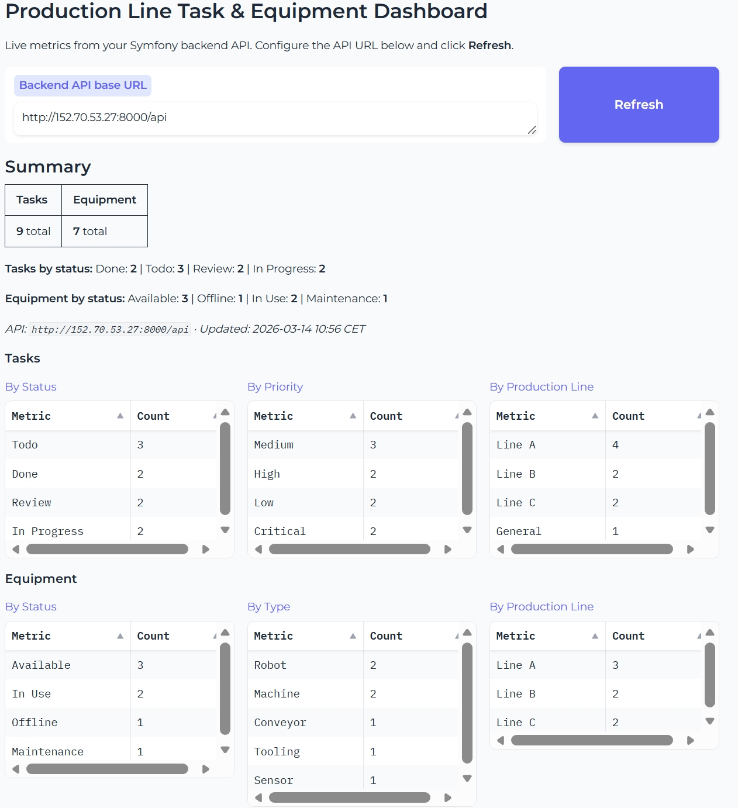

# Production Line Task and Equipment Manager

<p align="center">
  <a href="https://github.com/mr-robot77/task-manager-fullstack/actions/workflows/ci.yml" target="_blank" rel="noopener noreferrer">
    
  </a>
  <a href="https://github.com/mr-robot77/task-manager-fullstack/actions/workflows/smoke-test.yml" target="_blank" rel="noopener noreferrer">
    
  </a>
  <a href="https://github.com/mr-robot77/task-manager-fullstack/actions/workflows/deploy-oracle-vm.yml" target="_blank" rel="noopener noreferrer">
    
  </a>
</p>

A full-stack web application for managing production line tasks and equipment in semiconductor manufacturing. It provides a dashboard, task management, equipment tracking, authentication, and a public live statistics dashboard on Hugging Face.

---

## Overview

| Audience | What you get |
|----------|--------------|
| **End users** | Web interface to manage tasks, equipment, view dashboards. Demo data when backend is offline. |
| **Developers** | REST API, Angular SPA, Docker deployment, CI/CD, Oracle Cloud and Hugging Face integration. |

### Key Features

- **Authentication** — Register, login, JWT-based session
- **Tasks** — Create, edit, delete, filter by status, priority, production line
- **Equipment** — Manage machines, robots, sensors; link to tasks
- **Dashboard** — Overview of tasks and equipment statistics
- **Live Dashboard** — Public Gradio app on Hugging Face Spaces (reads from deployed backend)
- **Offline resilience** — Demo data when API is unreachable

---

## Demo


## Hugging Face dashboard live


---

## Quick Start

**Prerequisites:** <a href="https://www.docker.com/products/docker-desktop/" target="_blank" rel="noopener noreferrer">Docker Desktop</a>, <a href="https://git-scm.com/" target="_blank" rel="noopener noreferrer">Git</a>

```bash
git clone https://github.com/mr-robot77/task-manager-fullstack.git
cd task-manager-fullstack
docker compose up --build
```

Wait about 90 seconds for the backend to become ready, then open:

| Service | URL |
|---------|-----|
| **Frontend** | [http://localhost:4200](http://localhost:4200) |
| **API** | [http://localhost:8000/api](http://localhost:8000/api) |

**Demo login:** `demo@example.com` / `demodemo` (auto-login on first visit)

The default setup uses **PostgreSQL**. For **MSSQL**:

```bash
docker compose -f docker-compose.mssql.yml up --build
```

---

## Live Instances

| Environment | Frontend | API |
|-------------|----------|-----|
| **Local** | [localhost:4200](http://localhost:4200) | [localhost:8000/api](http://localhost:8000/api) |
| **Oracle VM** | [152.70.53.27:4200](http://152.70.53.27:4200) | [152.70.53.27:8000/api](http://152.70.53.27:8000/api) |
| **Live Dashboard** | — | **[Hugging Face Spaces](https://huggingface.co/spaces/mrrobot777/task-manager-live-dashboard)** |

---

## Architecture

```
┌─────────────────┐          ┌─────────────────┐          ┌─────────────────┐
│  Angular SPA    │  ◄─────► │  Symfony API    │  ◄─────► │  Database       │
│  (Frontend)     │   HTTP   │  (Backend)      │  ORM     │  PostgreSQL/MSSQL│
└─────────────────┘          └─────────────────┘          └─────────────────┘
         │                              │
         └──────────────────────────────┼──► Hugging Face Dashboard (stats)
```

| Component | Role |
|-----------|------|
| **Frontend** | Angular 17 SPA. User interface, forms, tables, dashboard. |
| **Backend** | Symfony PHP API. Authentication, CRUD, business logic. |
| **Database** | Stores users, tasks, equipment. PostgreSQL (default) or MSSQL. |

---

## Tech Stack

| Layer | Technology |
|-------|------------|
| Frontend | Angular 17, TypeScript, Angular Material |
| Backend | PHP 8.2, Symfony 7 |
| Database | PostgreSQL 15 / Microsoft SQL Server |
| Auth | JWT |
| Deployment | Docker, Docker Compose |

### Database Options

| Option | RAM | Use case |
|--------|-----|----------|
| PostgreSQL | ~512MB | Local dev, default |
| MSSQL | ≥2GB | Production |
| PostgreSQL | ~1GB | Oracle Always Free VM |

---

## Deployment

### Oracle Cloud VM

See `deploy/oracle/README.md`. Uses PostgreSQL on 1GB VMs. GitHub Actions can deploy automatically (requires `ORACLE_VM_HOST`, `ORACLE_VM_USER`, `ORACLE_VM_SSH_KEY`).

### Hugging Face Dashboard

```bash
pip install huggingface_hub
python hf-dashboard/deploy_to_hf.py
```

Requires `HF_TOKEN` (from [huggingface.co/settings/tokens](https://huggingface.co/settings/tokens)).

---

## API Reference

| Method | Endpoint | Auth | Description |
|--------|----------|------|-------------|
| POST | `/api/register` | Public | Register |
| POST | `/api/login_check` | Public | Login (returns JWT) |
| GET | `/api/me` | Required | Current user |
| GET/POST | `/api/tasks` | Required | List, create |
| GET/PUT/DELETE | `/api/tasks/{id}` | Required | Get, update, delete |
| GET | `/api/tasks/statistics` | Public | Task stats |
| GET/POST | `/api/equipment` | Required | List, create |
| GET/PUT/DELETE | `/api/equipment/{id}` | Required | Get, update, delete |
| GET | `/api/equipment/statistics` | Public | Equipment stats |

**Filters:** Tasks: `status`, `priority`, `productionLine`. Equipment: `status`, `type`, `productionLine`.

---

## Project Structure

```
task-manager-fullstack/
├── backend/              # Symfony PHP API
│   ├── src/
│   │   ├── Command/      # CLI (app:load-demo-data)
│   │   ├── Controller/   # REST endpoints
│   │   ├── Entity/       # Task, Equipment, User
│   │   └── Repository/
│   ├── config/
│   └── Dockerfile
├── frontend/             # Angular 17 SPA
│   ├── src/app/
│   │   ├── components/
│   │   ├── services/
│   │   └── interceptors/
│   └── Dockerfile
├── deploy/oracle/        # Oracle VM deployment
│   ├── docker-compose.prod-pgsql.yml
│   ├── sync-and-deploy.sh
│   └── README.md
├── hf-dashboard/         # Gradio dashboard for Hugging Face
│   ├── app.py
│   └── deploy_to_hf.py
├── assets/               # demo.gif
├── scripts/              # make-demo-gif.mjs
└── .github/workflows/    # CI, smoke test, deploy
```

---

## Development

**Backend:**
```bash
cd backend && composer install && php bin/console server:start
```

**Frontend:**
```bash
cd frontend && npm install && ng serve
```

**Tests:**
```bash
cd backend && php vendor/bin/phpunit --testdox
cd frontend && npm run test:ci
```

---

## Troubleshooting

| Issue | Solution |
|-------|----------|
| Demo data instead of live API | Check backend health: `docker compose ps`. Ensure backend container is running. |
| Oracle VM: zeros or old data | Run `./deploy/oracle/sync-and-deploy.sh` on the VM. |
| Backend "no such file" on Windows | Run `git add --renormalize .` and rebuild. |
